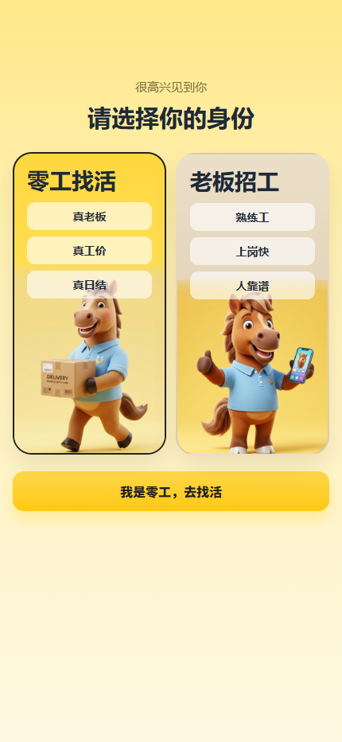
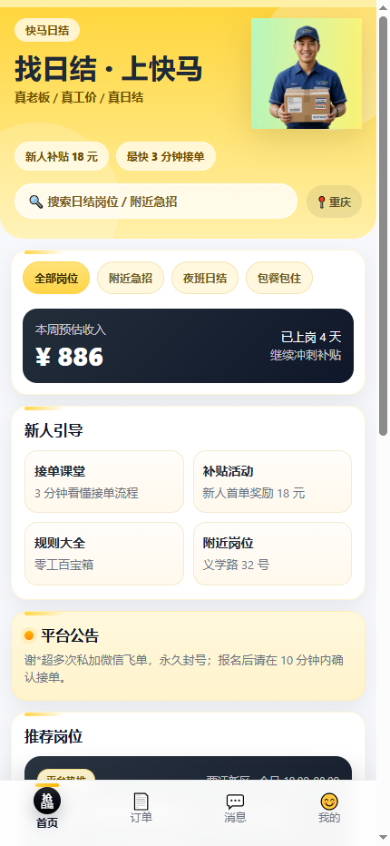
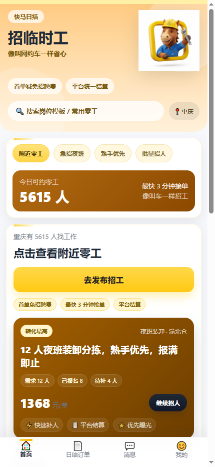

# kuaima-web-static

快马日结手机版静态 Web / H5 版。

## 项目预览

> 以下截图已按**手机视口**重新生成，用于展示移动端 H5 页面效果，不是 PC 官网页面。

### 首页

### 零工端

### 老板端

## 项目说明

这是将原 uni-app 小程序前端整理为可直接部署到 GitHub Pages / EdgeOne Pages 的**手机版静态 Web / H5 Demo**，重点是移动端观感与手机端信息结构还原，不是 PC 官网版本。包含：

- 身份选择页
- 零工端：首页 / 订单 / 消息 / 我的
- 老板端：首页 / 日结订单 / 消息 / 我的
- 适配静态托管的 hash 路由
- README / 部署 / UI / QA / 巡检日志等配套文档

## 目录说明

- `index.html`：入口页面
- `styles.css`：样式
- `app.js`：交互逻辑
- `static/`：静态资源
- `404.html`：静态托管 SPA 回退页

## 本地预览

直接打开 `index.html`，或用任意静态服务器托管。

## 在线预览

> 建议用浏览器移动端模拟模式或直接用手机打开查看，页面按手机端视觉结构设计。

- GitHub Pages：首页 `https://shuishen49.github.io/kuaima/`
- 零工页：`https://shuishen49.github.io/kuaima/#worker`
- 老板页：`https://shuishen49.github.io/kuaima/#boss`

## 静态托管建议

- 构建输出目录：项目根目录（当前仓库根）
- 首页：`/index.html`
- 404：`/404.html`
- 支持 hash 路由，可直接访问如 `/#worker`

## 文档导航

- 部署说明：`docs/README_DEPLOY.md` 或仓库根 `README_DEPLOY.md`
- 产品 / UI / QA：`docs/PM_PLAN.md`、`docs/UI_GUIDE.md`、`docs/QA_CHECKLIST.md`
- 进度巡检日志：`docs/PROGRESS_LOG.md`
- 浏览器控制安装总结：`docs/AGENT_BROWSER_INSTALL_SUMMARY.md`

## 联系方式

- QQ：`93418328`
- 微信：`shuishen49`
